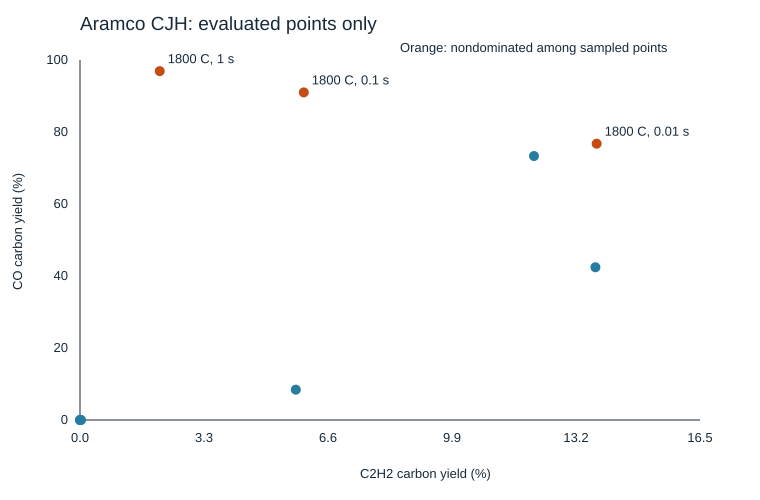

# Aramco CJH sampled map

Generated by tools/openmkm_dynamic/summarize_cjh_map.py. CH4/CO2=50/50, 1 atm.
Prescribed constant gas temperature, homogeneous CSTR; no heater-energy or device validation.
Carbon yields use total inlet carbon. AA is a stoichiometric feed-combination ceiling, not reaction yield.
Mass-normalized rates are conditional at 50 sccm (0 C, 1 atm), CFP 28.8 mg.

| T (C) | tau (s) | C2H2 C-yield % | C2H4 C-yield % | CO C-yield % | AA upper C-yield % | C2 stable mg/mgCFP/h | CO mg/mgCFP/h | Sampled Pareto |
|---|---|---|---|---|---|---|---|---|
| 1000 | 0.01 | 0.00000 | 0.00004 | 0.00001 | 0.00000 | 0.00083 | 0.00001 | no |
| 1000 | 0.1 | 0.00005 | 0.00348 | 0.00008 | 0.00008 | 0.01003 | 0.00010 | no |
| 1000 | 1 | 0.02803 | 0.15334 | 0.00895 | 0.02632 | 0.14723 | 0.01166 | no |
| 1400 | 0.01 | 5.73362 | 1.76124 | 8.42575 | 8.60044 | 4.71752 | 10.96810 | no |
| 1400 | 0.1 | 13.69313 | 0.57507 | 42.42517 | 20.53970 | 8.67456 | 55.22632 | no |
| 1400 | 1 | 12.06170 | 0.34742 | 73.32498 | 18.09255 | 7.52733 | 95.44967 | no |
| 1800 | 0.01 | 13.72683 | 0.10737 | 76.75367 | 20.59025 | 8.37743 | 99.91292 | yes |
| 1800 | 0.1 | 5.94589 | 0.02342 | 91.00096 | 8.91883 | 3.61309 | 118.45911 | yes |
| 1800 | 1 | 2.11824 | 0.00594 | 96.90178 | 3.17736 | 1.28554 | 126.14041 | yes |

Only evaluated points are shown. Nondominance does not establish a global optimum.
Initial-condition and tolerance robustness beyond the recorded gates remains untested.
