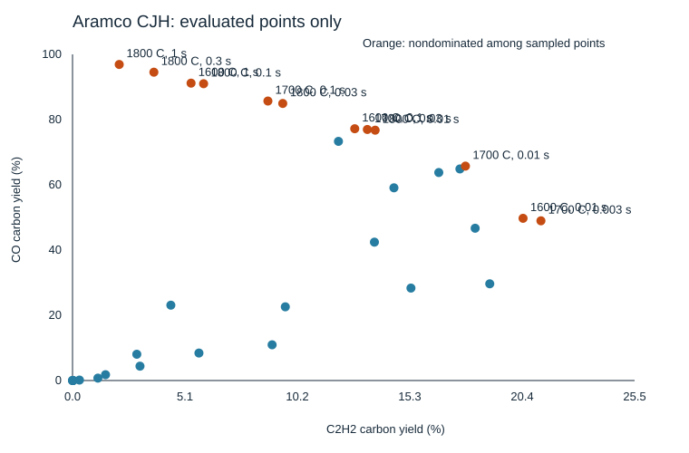

# Aramco CJH sampled map

Generated by tools/openmkm_dynamic/summarize_cjh_map.py. CH4/CO2=50/50, 1 atm.
Prescribed constant gas temperature, homogeneous CSTR; no heater-energy or device validation.
Carbon yields use total inlet carbon. AA is a stoichiometric feed-combination ceiling, not reaction yield.
Mass-normalized rates are conditional at 50 sccm (0 C, 1 atm), CFP 28.8 mg.

| T (C) | tau (s) | C2H2 C-yield % | C2H4 C-yield % | CO C-yield % | AA upper C-yield % | C2 stable mg/mgCFP/h | CO mg/mgCFP/h | Sampled Pareto |
|---|---|---|---|---|---|---|---|---|
| 1000 | 0.01 | 0.00000 | 0.00004 | 0.00001 | 0.00000 | 0.00083 | 0.00001 | no |
| 1000 | 0.1 | 0.00005 | 0.00348 | 0.00008 | 0.00008 | 0.01003 | 0.00010 | no |
| 1000 | 1 | 0.02803 | 0.15334 | 0.00895 | 0.02632 | 0.14723 | 0.01166 | no |
| 1200 | 0.01 | 0.02270 | 0.16760 | 0.00730 | 0.01954 | 0.19032 | 0.00950 | no |
| 1200 | 0.03 | 0.31415 | 0.78907 | 0.13994 | 0.39738 | 0.82204 | 0.18216 | no |
| 1200 | 0.1 | 1.49672 | 1.42120 | 1.78281 | 2.24507 | 1.93400 | 2.32075 | no |
| 1200 | 0.3 | 2.91563 | 1.24416 | 8.05487 | 4.37344 | 2.63414 | 10.48530 | no |
| 1200 | 1 | 4.46000 | 0.88942 | 23.10061 | 6.69001 | 3.30427 | 30.07086 | no |
| 1300 | 0.01 | 1.15077 | 1.61848 | 0.73708 | 1.72615 | 1.91789 | 0.95948 | no |
| 1300 | 0.03 | 3.05991 | 1.68683 | 4.40096 | 4.58987 | 3.05871 | 5.72888 | no |
| 1400 | 0.01 | 5.73362 | 1.76124 | 8.42575 | 8.60044 | 4.71752 | 10.96810 | no |
| 1400 | 0.03 | 9.65151 | 0.97773 | 22.59660 | 14.47726 | 6.51877 | 29.41478 | no |
| 1400 | 0.1 | 13.69313 | 0.57507 | 42.42517 | 20.53970 | 8.67456 | 55.22632 | no |
| 1400 | 0.3 | 14.57810 | 0.45083 | 59.08382 | 21.86715 | 9.12089 | 76.91147 | no |
| 1400 | 1 | 12.06170 | 0.34742 | 73.32498 | 18.09255 | 7.52733 | 95.44967 | no |
| 1500 | 0.003 | 9.05309 | 1.90255 | 10.95143 | 13.57963 | 6.81667 | 14.25585 | no |
| 1500 | 0.01 | 15.34981 | 0.89224 | 28.34269 | 23.02471 | 9.90342 | 36.89467 | no |
| 1500 | 0.03 | 18.26210 | 0.49664 | 46.68865 | 27.39315 | 11.38661 | 60.77624 | no |
| 1500 | 0.1 | 16.61268 | 0.31118 | 63.77097 | 24.91903 | 10.25997 | 83.01289 | no |
| 1600 | 0.003 | 18.92468 | 0.95914 | 29.65275 | 28.38702 | 12.11055 | 38.60001 | no |
| 1600 | 0.01 | 20.43466 | 0.44805 | 49.73280 | 30.65199 | 12.66851 | 64.73891 | yes |
| 1600 | 0.03 | 17.57042 | 0.25025 | 64.86957 | 26.35563 | 10.79961 | 84.44297 | no |
| 1600 | 0.1 | 12.80056 | 0.13799 | 77.19804 | 19.20084 | 7.83718 | 100.49137 | yes |
| 1600 | 1 | 5.37639 | 0.04458 | 91.17477 | 8.06459 | 3.28236 | 118.68537 | yes |
| 1700 | 0.003 | 21.24532 | 0.48911 | 48.96890 | 31.86798 | 13.18667 | 63.74453 | yes |
| 1700 | 0.01 | 17.82151 | 0.22473 | 65.73720 | 26.73226 | 10.93453 | 85.57239 | yes |
| 1700 | 0.03 | 13.37204 | 0.11529 | 76.96977 | 20.05806 | 8.16810 | 100.19423 | yes |
| 1700 | 0.1 | 8.86217 | 0.05692 | 85.68974 | 13.29325 | 5.39996 | 111.54532 | yes |
| 1800 | 0.01 | 13.72683 | 0.10737 | 76.75367 | 20.59025 | 8.37743 | 99.91292 | yes |
| 1800 | 0.03 | 9.53523 | 0.05109 | 84.94618 | 14.30285 | 5.80340 | 110.57739 | yes |
| 1800 | 0.1 | 5.94589 | 0.02342 | 91.00096 | 8.91883 | 3.61309 | 118.45911 | yes |
| 1800 | 0.3 | 3.68996 | 0.01193 | 94.53281 | 5.53494 | 2.24048 | 123.05664 | yes |
| 1800 | 1 | 2.11824 | 0.00594 | 96.90178 | 3.17736 | 1.28554 | 126.14041 | yes |

Only evaluated points are shown. Nondominance does not establish a global optimum.
Initial-condition and tolerance robustness beyond the recorded gates remains untested.
