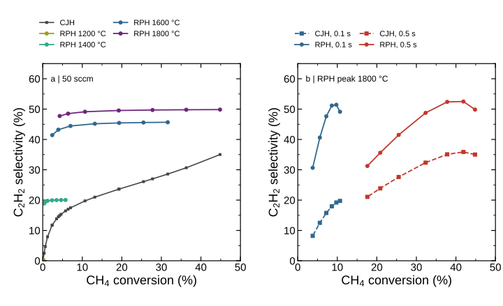

# Conversion versus acetylene selectivity

Selectivity is 100 × 2 n(C2H2,out) / [n(CH4,in) − n(CH4,out)]. For RPH, amounts are integrated over the converged cycle; CJH uses steady flows. With equimolar CH4/CO2 feed, this equals the total-feed-carbon yield in percent divided by (0.5 × methane conversion as a fraction). This methane-consumption normalization does not establish the carbon provenance of C2H2 in a two-carbon-source feed.

(a) Fixed 50 sccm: CJH temperatures are matched individually to each RPH conversion. RPH curves vary hot hold from 0.025 to 0.50 s at each indicated peak temperature. (b) RPH peak 1800 °C: each curve varies flow from 50 to 1600 sccm at the indicated RPH hot hold; CJH dashed curves contain the corresponding individually matched steady states. The 0.50 s series includes 1215.743353 sccm. Lines guide the eye; no new integration or fitted selectivity curve is introduced. All 39 pairs are included in panel (a) or (b); their overlap is intentional.

Both panels retain the fixed gas volume, equimolar undiluted feed and 1 atm pressure. RPH floor 450 °C, period 1 s, rise 0.025 s and fall 0.10 s. The three flagged low-conversion points remain in the figure but are not evidence of a resolved trace-selectivity advantage. This is a prescribed gas-temperature comparison, not an equal-power comparison. Full paired values and warnings are in conversion-selectivity.json.

Regenerate with `python tools/openmkm_dynamic/plot_matched_xs.py` after regenerating the matched report.
