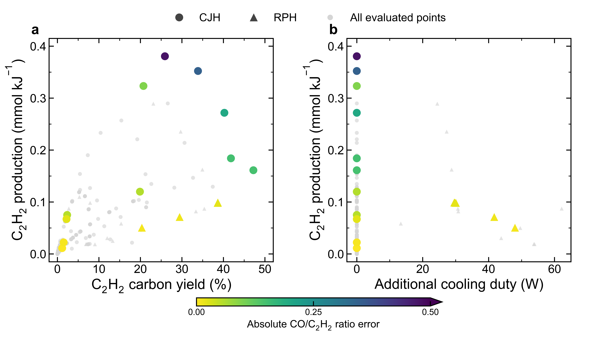
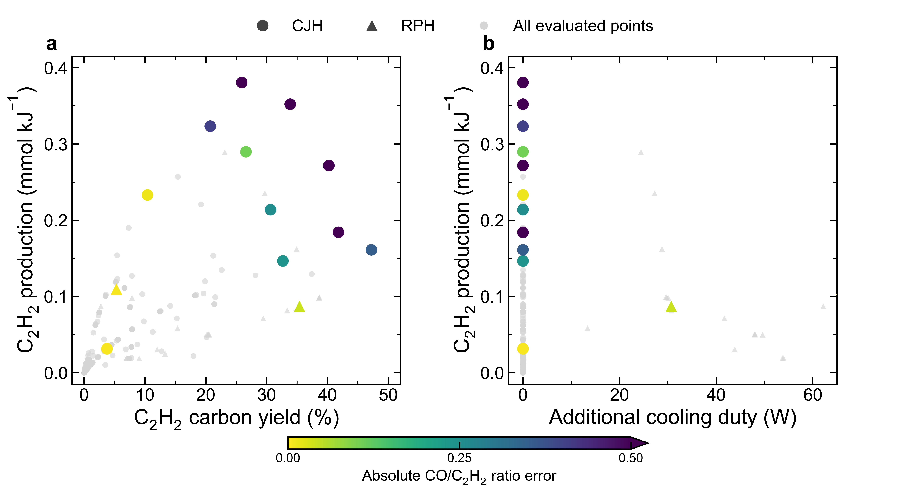
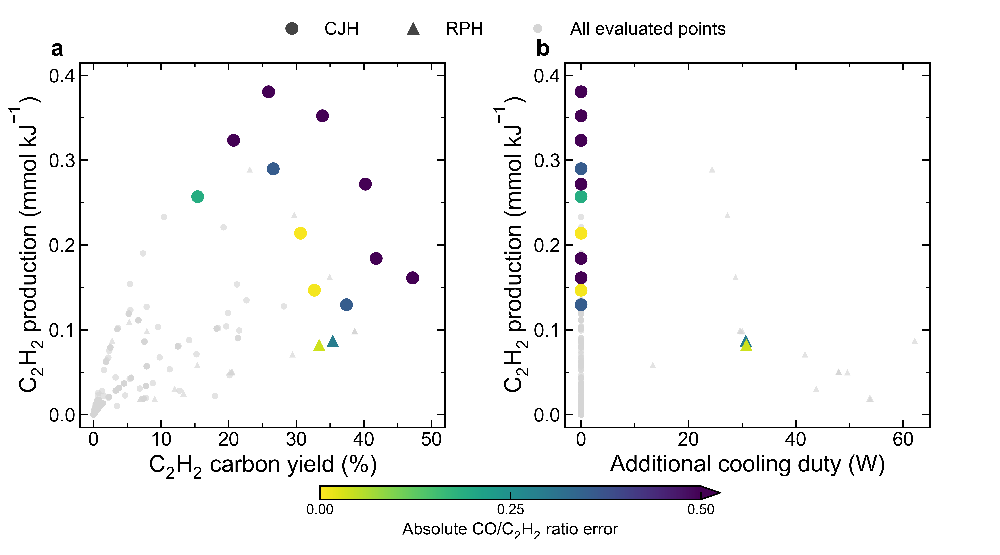

# Four-objective Pareto projections

## Target CO/C2H2 = 1

## Target CO/C2H2 = 1.5

## Target CO/C2H2 = 1.75

Both panels show the same four-objective Pareto set. Panel a projects yield against energy-specific production; panel b projects additional cooling against energy-specific production. Color gives absolute molar-ratio mismatch, with values above 0.5 at the darkest endpoint. Circles denote CJH and triangles RPH. Gray points show eligible archived records. A colored point can appear inferior in either two-dimensional projection while remaining nondominated in four dimensions. Coincident points overlap.

CH4/CO2 CSTR archive; 90% lower radiation, imposed temperature histories retained. Cooling-system electricity is excluded. Operating conditions vary between records. Target ratio is an objective, not an enforced tolerance constraint. Each panel receives a 5-inch-square allocation plus shared legend and colorbar space. No new reaction evaluations.

Reproduce with `/usr/bin/python3 tools/openmkm_dynamic/draw_four_objective_pareto.py`.
