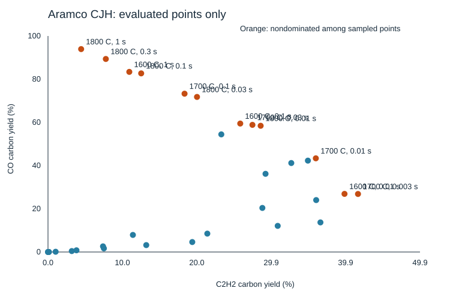

# Aramco CJH sampled map

Generated by tools/openmkm_dynamic/summarize_cjh_map.py. CH4/H2O=50/50, 1 atm.
Prescribed constant gas temperature, homogeneous CSTR; no heater-energy or device validation.
Carbon yields use total inlet carbon. That denominator is all CH4 here and half CO2 in the CH4/CO2 map, so the two are not one scale.
Mass-normalized rates are conditional at 50 sccm (0 C, 1 atm), CFP 28.8 mg.

| T (C) | tau (s) | C2H2 C-yield % | C2H4 C-yield % | CO C-yield % | CH4 conversion % | C2 stable mg/mgCFP/h | CO mg/mgCFP/h | Sampled Pareto |
|---|---|---|---|---|---|---|---|---|
| 1000 | 0.01 | 0.00000 | 0.00015 | 0.00000 | 0.00448 | 0.00131 | 0.00000 | no |
| 1000 | 0.1 | 0.00032 | 0.01234 | 0.00002 | 0.04579 | 0.01514 | 0.00001 | no |
| 1000 | 1 | 0.11385 | 0.42893 | 0.01593 | 1.00119 | 0.21268 | 0.01037 | no |
| 1200 | 0.01 | 0.11512 | 0.52737 | 0.00772 | 1.09931 | 0.29974 | 0.00503 | no |
| 1200 | 0.03 | 1.02457 | 1.74939 | 0.11760 | 5.55530 | 1.01054 | 0.07654 | no |
| 1200 | 0.1 | 3.81870 | 2.53984 | 0.78364 | 18.32423 | 2.07998 | 0.51004 | no |
| 1200 | 0.3 | 7.37958 | 2.37087 | 2.60831 | 34.60490 | 3.05734 | 1.69766 | no |
| 1200 | 1 | 11.38931 | 2.42996 | 7.90312 | 51.68257 | 4.26139 | 5.14388 | no |
| 1300 | 0.01 | 3.19048 | 3.04567 | 0.43322 | 13.72986 | 2.12491 | 0.28197 | no |
| 1300 | 0.03 | 7.49915 | 2.88972 | 1.66888 | 29.69747 | 3.30901 | 1.08622 | no |
| 1400 | 0.01 | 13.18295 | 2.99021 | 3.19372 | 41.22303 | 5.05349 | 2.07869 | no |
| 1400 | 0.03 | 21.37504 | 1.96756 | 8.50858 | 57.99097 | 7.14689 | 5.53796 | no |
| 1400 | 0.1 | 28.76241 | 1.51713 | 20.39894 | 70.57865 | 9.21143 | 13.27700 | no |
| 1400 | 0.3 | 29.18650 | 1.31521 | 36.19437 | 77.96464 | 9.26562 | 23.55774 | no |
| 1400 | 1 | 23.25342 | 1.01759 | 54.45381 | 84.18166 | 7.36965 | 35.44221 | no |
| 1500 | 0.003 | 19.35714 | 3.24824 | 4.61003 | 48.05817 | 7.00598 | 3.00052 | no |
| 1500 | 0.01 | 30.82052 | 1.81750 | 12.09356 | 64.89494 | 9.95115 | 7.87130 | no |
| 1500 | 0.03 | 35.98308 | 1.20419 | 24.03648 | 74.84768 | 11.29311 | 15.64456 | no |
| 1500 | 0.1 | 32.64260 | 0.83505 | 41.18990 | 82.15128 | 10.15353 | 26.80917 | no |
| 1600 | 0.003 | 36.55412 | 1.88171 | 13.70119 | 68.05832 | 11.70780 | 8.91766 | no |
| 1600 | 0.01 | 39.78408 | 1.00421 | 26.90892 | 78.29131 | 12.37680 | 17.51414 | yes |
| 1600 | 0.03 | 34.87074 | 0.61046 | 42.30278 | 84.50666 | 10.75421 | 27.53350 | no |
| 1600 | 0.1 | 25.79355 | 0.36281 | 59.46949 | 89.59385 | 7.92375 | 38.70675 | yes |
| 1600 | 1 | 10.90889 | 0.12873 | 83.38977 | 95.78876 | 3.34247 | 54.27568 | yes |
| 1700 | 0.003 | 41.59339 | 1.00782 | 26.85989 | 79.92586 | 12.92608 | 17.48222 | yes |
| 1700 | 0.01 | 35.93448 | 0.50136 | 43.36972 | 86.53341 | 11.04006 | 28.22793 | yes |
| 1700 | 0.03 | 27.42933 | 0.27721 | 58.86222 | 90.78250 | 8.39069 | 38.31150 | yes |
| 1700 | 0.1 | 18.32186 | 0.14832 | 73.29281 | 94.17016 | 5.59197 | 47.70390 | yes |
| 1800 | 0.01 | 28.53246 | 0.23795 | 58.43988 | 91.83546 | 8.71150 | 38.03661 | yes |
| 1800 | 0.03 | 19.99187 | 0.12213 | 71.79120 | 94.64659 | 6.08868 | 46.72655 | yes |
| 1800 | 0.1 | 12.50222 | 0.06076 | 82.69757 | 96.76215 | 3.80231 | 53.82515 | yes |
| 1800 | 0.3 | 7.75805 | 0.03297 | 89.36557 | 98.01650 | 2.35784 | 58.16514 | yes |
| 1800 | 1 | 4.44686 | 0.01726 | 93.93524 | 98.86638 | 1.35094 | 61.13938 | yes |

Only evaluated points are shown. Nondominance does not establish a global optimum.
Initial-condition and tolerance robustness beyond the recorded gates remains untested.
