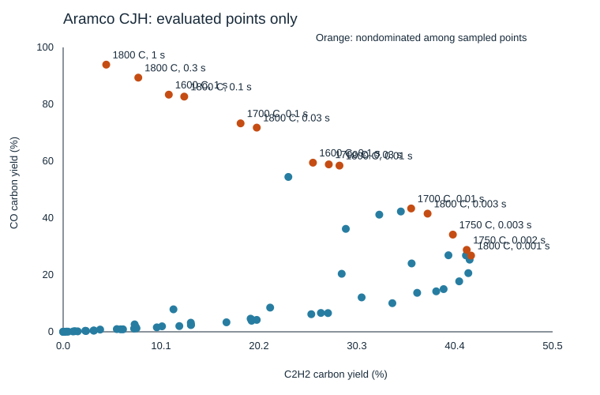

# Aramco CJH sampled map

Generated by tools/openmkm_dynamic/summarize_cjh_map.py. CH4/H2O=50/50, 1 atm.
Prescribed constant gas temperature, homogeneous CSTR; no heater-energy or device validation.
Carbon yields use total inlet carbon. That denominator is all CH4 here and half CO2 in the CH4/CO2 map, so the two are not one scale.
Mass-normalized rates are conditional at 50 sccm (0 C, 1 atm), CFP 28.8 mg.

| T (C) | tau (s) | C2H2 C-yield % | C2H4 C-yield % | CO C-yield % | CH4 conversion % | C2 stable mg/mgCFP/h | CO mg/mgCFP/h | Sampled Pareto |
|---|---|---|---|---|---|---|---|---|
| 1000 | 0.01 | 0.00000 | 0.00015 | 0.00000 | 0.00448 | 0.00131 | 0.00000 | no |
| 1000 | 0.1 | 0.00032 | 0.01234 | 0.00002 | 0.04579 | 0.01514 | 0.00001 | no |
| 1000 | 1 | 0.11385 | 0.42893 | 0.01593 | 1.00119 | 0.21268 | 0.01037 | no |
| 1200 | 0.01 | 0.11512 | 0.52737 | 0.00772 | 1.09931 | 0.29974 | 0.00503 | no |
| 1200 | 0.03 | 1.02457 | 1.74939 | 0.11760 | 5.55530 | 1.01054 | 0.07654 | no |
| 1200 | 0.1 | 3.81870 | 2.53984 | 0.78364 | 18.32423 | 2.07998 | 0.51004 | no |
| 1200 | 0.3 | 7.37958 | 2.37087 | 2.60831 | 34.60490 | 3.05734 | 1.69766 | no |
| 1200 | 1 | 11.38931 | 2.42996 | 7.90312 | 51.68257 | 4.26139 | 5.14388 | no |
| 1300 | 0.003 | 0.51142 | 1.39322 | 0.04310 | 3.19614 | 0.77419 | 0.02805 | no |
| 1300 | 0.01 | 3.19048 | 3.04567 | 0.43322 | 13.72986 | 2.12491 | 0.28197 | no |
| 1300 | 0.03 | 7.49915 | 2.88972 | 1.66888 | 29.69747 | 3.30901 | 1.08622 | no |
| 1400 | 0.001 | 1.50407 | 2.75453 | 0.15606 | 7.24843 | 1.58721 | 0.10158 | no |
| 1400 | 0.003 | 5.93016 | 4.00594 | 0.87236 | 21.30277 | 3.28734 | 0.56779 | no |
| 1400 | 0.01 | 13.18295 | 2.99021 | 3.19372 | 41.22303 | 5.05349 | 2.07869 | no |
| 1400 | 0.03 | 21.37504 | 1.96756 | 8.50858 | 57.99097 | 7.14689 | 5.53796 | no |
| 1400 | 0.1 | 28.76241 | 1.51713 | 20.39894 | 70.57865 | 9.21143 | 13.27700 | no |
| 1400 | 0.3 | 29.18650 | 1.31521 | 36.19437 | 77.96464 | 9.26562 | 23.55774 | no |
| 1400 | 1 | 23.25342 | 1.01759 | 54.45381 | 84.18166 | 7.36965 | 35.44221 | no |
| 1500 | 0.0003 | 2.36638 | 3.84347 | 0.28448 | 10.41663 | 2.24384 | 0.18516 | no |
| 1500 | 0.001 | 9.67097 | 4.82362 | 1.55865 | 29.07883 | 4.68970 | 1.01447 | no |
| 1500 | 0.003 | 19.35714 | 3.24824 | 4.61003 | 48.05817 | 7.00598 | 3.00052 | no |
| 1500 | 0.01 | 30.82052 | 1.81750 | 12.09356 | 64.89494 | 9.95115 | 7.87130 | no |
| 1500 | 0.03 | 35.98308 | 1.20419 | 24.03648 | 74.84768 | 11.29311 | 15.64456 | no |
| 1500 | 0.1 | 32.64260 | 0.83505 | 41.18990 | 82.15128 | 10.15353 | 26.80917 | no |
| 1550 | 0.0003 | 6.17952 | 5.42679 | 0.87464 | 20.64552 | 3.90032 | 0.56927 | no |
| 1550 | 0.001 | 16.86284 | 4.35107 | 3.33768 | 41.90236 | 6.65443 | 2.17239 | no |
| 1600 | 3e-05 | 0.14797 | 1.00358 | 0.02415 | 2.61854 | 0.51821 | 0.01572 | no |
| 1600 | 0.0001 | 3.13315 | 4.84442 | 0.43529 | 13.33801 | 2.81626 | 0.28332 | no |
| 1600 | 0.0003 | 11.99532 | 5.76432 | 2.01342 | 32.50237 | 5.71372 | 1.31047 | no |
| 1600 | 0.001 | 25.62197 | 3.51668 | 6.18865 | 53.51767 | 8.98589 | 4.02799 | no |
| 1600 | 0.003 | 36.55412 | 1.88171 | 13.70119 | 68.05832 | 11.70780 | 8.91766 | no |
| 1600 | 0.01 | 39.78408 | 1.00421 | 26.90892 | 78.29131 | 12.37680 | 17.51414 | no |
| 1600 | 0.03 | 34.87074 | 0.61046 | 42.30278 | 84.50666 | 10.75421 | 27.53350 | no |
| 1600 | 0.1 | 25.79355 | 0.36281 | 59.46949 | 89.59385 | 7.92375 | 38.70675 | yes |
| 1600 | 1 | 10.90889 | 0.12873 | 83.38977 | 95.78876 | 3.34247 | 54.27568 | yes |
| 1650 | 0.0001 | 7.32583 | 6.38842 | 1.14788 | 23.62079 | 4.56460 | 0.74712 | no |
| 1650 | 0.0003 | 19.45805 | 5.18897 | 3.88374 | 44.18781 | 7.72363 | 2.52780 | no |
| 1700 | 3e-05 | 2.28687 | 4.66887 | 0.36411 | 12.07372 | 2.47363 | 0.23699 | no |
| 1700 | 6e-05 | 7.57145 | 6.78004 | 1.25087 | 24.66385 | 4.76076 | 0.81415 | no |
| 1700 | 0.0001 | 13.19302 | 6.67256 | 2.37177 | 34.73544 | 6.37498 | 1.54371 | no |
| 1700 | 0.0003 | 27.34781 | 4.25999 | 6.58035 | 54.59483 | 9.75962 | 4.28293 | no |
| 1700 | 0.001 | 39.28607 | 2.01722 | 15.01190 | 70.60297 | 12.57854 | 9.77076 | no |
| 1700 | 0.003 | 41.59339 | 1.00782 | 26.85989 | 79.92586 | 12.92608 | 17.48222 | no |
| 1700 | 0.01 | 35.93448 | 0.50136 | 43.36972 | 86.53341 | 11.04006 | 28.22793 | yes |
| 1700 | 0.03 | 27.42933 | 0.27721 | 58.86222 | 90.78250 | 8.39069 | 38.31150 | yes |
| 1700 | 0.1 | 18.32186 | 0.14832 | 73.29281 | 94.17016 | 5.59197 | 47.70390 | yes |
| 1725 | 0.001 | 40.89594 | 1.73418 | 17.74152 | 73.75783 | 12.96609 | 11.54738 | no |
| 1725 | 0.002 | 41.97224 | 1.10361 | 25.36626 | 79.45700 | 13.07354 | 16.51007 | no |
| 1750 | 1e-05 | 0.35260 | 1.79667 | 0.06665 | 5.01262 | 0.83232 | 0.04338 | no |
| 1750 | 3e-05 | 5.54230 | 6.65320 | 0.94768 | 21.12359 | 4.10332 | 0.61682 | no |
| 1750 | 6e-05 | 13.20083 | 7.07634 | 2.47173 | 35.36022 | 6.50551 | 1.60877 | no |
| 1750 | 0.0001 | 19.98978 | 6.07341 | 4.19019 | 45.35170 | 8.17734 | 2.72726 | no |
| 1750 | 0.0003 | 33.99096 | 3.32825 | 10.06322 | 63.33080 | 11.43188 | 6.54982 | no |
| 1750 | 0.001 | 41.83746 | 1.48633 | 20.63434 | 76.56995 | 13.16437 | 13.43022 | no |
| 1750 | 0.002 | 41.67241 | 0.93805 | 28.80941 | 81.68758 | 12.92563 | 18.75111 | yes |
| 1750 | 0.003 | 40.24172 | 0.72285 | 34.17371 | 84.08459 | 12.41901 | 22.24256 | yes |
| 1800 | 3e-06 | 0.01406 | 0.24767 | 0.00322 | 1.74707 | 0.11680 | 0.00210 | no |
| 1800 | 1e-05 | 1.20603 | 3.60439 | 0.22387 | 9.62151 | 1.72275 | 0.14571 | no |
| 1800 | 3e-05 | 10.20900 | 7.52584 | 1.92797 | 31.21011 | 5.75873 | 1.25486 | no |
| 1800 | 6e-05 | 19.49428 | 6.50248 | 4.21523 | 45.50329 | 8.16653 | 2.74355 | no |
| 1800 | 0.0001 | 26.61581 | 5.10197 | 6.62367 | 54.82783 | 9.81820 | 4.31113 | no |
| 1800 | 0.0003 | 38.52132 | 2.53007 | 14.23008 | 70.47943 | 12.51978 | 9.26190 | no |
| 1800 | 0.001 | 42.11900 | 1.08413 | 26.80507 | 81.32458 | 13.11015 | 17.44655 | yes |
| 1800 | 0.003 | 37.63145 | 0.51394 | 41.54738 | 87.41550 | 11.55786 | 27.04183 | yes |
| 1800 | 0.01 | 28.53246 | 0.23795 | 58.43988 | 91.83546 | 8.71150 | 38.03661 | yes |
| 1800 | 0.03 | 19.99187 | 0.12213 | 71.79120 | 94.64659 | 6.08868 | 46.72655 | yes |
| 1800 | 0.1 | 12.50222 | 0.06076 | 82.69757 | 96.76215 | 3.80231 | 53.82515 | yes |
| 1800 | 0.3 | 7.75805 | 0.03297 | 89.36557 | 98.01650 | 2.35784 | 58.16514 | yes |
| 1800 | 1 | 4.44686 | 0.01726 | 93.93524 | 98.86638 | 1.35094 | 61.13938 | yes |

Only evaluated points are shown. Nondominance does not establish a global optimum.
Initial-condition and tolerance robustness beyond the recorded gates remains untested.
