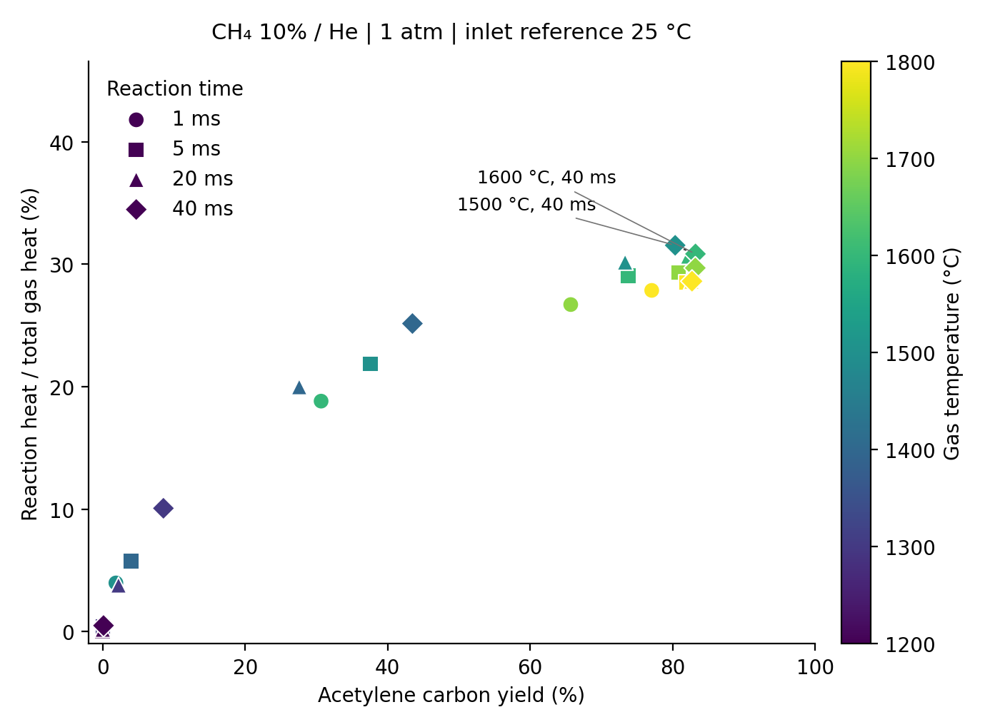

# Gas-only energy Pareto for CH4/He

Basis: one mol CH4 plus nine mol He at 298.15 K and 1 atm. Outlet compositions are reused from the isothermal parcel screen. No new reaction integration is performed.

Q_rxn = H_out(298.15 K) - H_in(298.15 K); Q_sensible = H_out(T) - H_out(298.15 K); Q_gas = Q_rxn + Q_sensible. The reaction fraction uses net reaction enthalpy referenced to 298.15 K. It includes all gaseous products. Heater heat storage, radiation, other device losses, and heat recovery are excluded.

Total heat also equals feed preheating plus isothermal reaction enthalpy at the reaction temperature. Both paths and elemental balances were checked. A point is Pareto-efficient if no sampled point has both greater or equal acetylene yield and greater or equal reaction-heat fraction, with one strict improvement. Only 1800 C samples have individual paired refinement.

| T (C) | Time (ms) | C2H2 yield (%) | Reaction heat fraction (%) | Gas heat (kJ/mol CH4) | C2H2 (mmol/kJ) | Pareto |
|---|---|---|---|---|---|---|
| 1200 | 1 | 0.000 | 0.013 | 297.437 | 0.000 | False |
| 1200 | 5 | 0.000 | 0.039 | 297.519 | 0.000 | False |
| 1200 | 20 | 0.015 | 0.178 | 297.964 | 0.000 | False |
| 1200 | 40 | 0.117 | 0.494 | 298.983 | 0.002 | False |
| 1300 | 1 | 0.000 | 0.073 | 325.461 | 0.000 | False |
| 1300 | 5 | 0.045 | 0.397 | 326.588 | 0.001 | False |
| 1300 | 20 | 2.221 | 3.790 | 339.043 | 0.033 | False |
| 1300 | 40 | 8.525 | 10.071 | 365.212 | 0.117 | False |
| 1400 | 1 | 0.025 | 0.464 | 355.002 | 0.000 | False |
| 1400 | 5 | 4.007 | 5.745 | 376.408 | 0.053 | False |
| 1400 | 20 | 27.589 | 19.984 | 450.919 | 0.306 | False |
| 1400 | 40 | 43.480 | 25.158 | 484.961 | 0.448 | False |
| 1500 | 1 | 1.856 | 3.975 | 398.272 | 0.023 | False |
| 1500 | 5 | 37.583 | 21.852 | 498.195 | 0.377 | False |
| 1500 | 20 | 73.334 | 30.166 | 561.925 | 0.653 | False |
| 1500 | 40 | 80.361 | 31.547 | 574.056 | 0.700 | True |
| 1600 | 1 | 30.659 | 18.821 | 512.409 | 0.299 | False |
| 1600 | 5 | 73.751 | 29.053 | 592.307 | 0.623 | False |
| 1600 | 20 | 82.192 | 30.649 | 607.006 | 0.677 | False |
| 1600 | 40 | 83.211 | 30.844 | 608.863 | 0.683 | True |
| 1700 | 1 | 65.699 | 26.707 | 610.666 | 0.538 | False |
| 1700 | 5 | 80.835 | 29.313 | 634.901 | 0.637 | False |
| 1700 | 20 | 82.912 | 29.651 | 638.210 | 0.650 | False |
| 1700 | 40 | 83.191 | 29.697 | 638.658 | 0.651 | False |
| 1800 | 1 | 77.067 | 27.865 | 660.684 | 0.583 | False |
| 1800 | 5 | 81.931 | 28.515 | 667.184 | 0.614 | False |
| 1800 | 20 | 82.645 | 28.604 | 668.079 | 0.619 | False |
| 1800 | 40 | 82.726 | 28.614 | 668.183 | 0.619 | False |

Reproduce: `/Users/robin_yeonsu/cantera-env/bin/python tools/openmkm_dynamic/parcel_energy_pareto.py` from the repository root.
