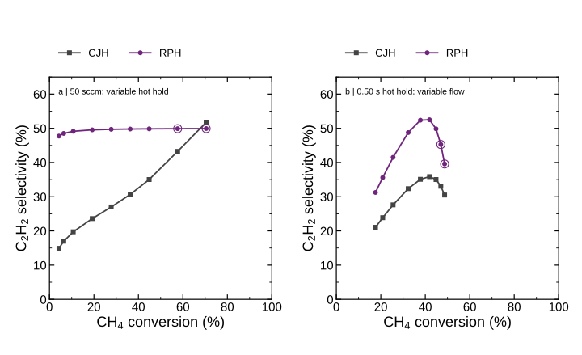

# Higher-conversion pulse extension

Four new RPH points and their individually matched CJH states passed all configured checks. The original 39-pair report is unchanged.

| Flow sccm | Hot hold s | CH4 X % | Matched CJH C | CJH C2H2 S % | RPH C2H2 S % | RPH C2H2 Y C% | RPH total C6 Y C% |
|---|---|---|---|---|---|---|---|
| 50 | 0.5 | 44.83673 | 1530.03 | 35.01977 | 49.84054 | 11.17343 | 0.493601 |
| 12.5 | 0.5 | 48.69349 | 1447.702 | 30.494 | 39.57436 | 9.635067 | 0.3552327 |
| 25 | 0.5 | 46.98471 | 1488.484 | 33.05528 | 45.26649 | 10.63416 | 0.3923641 |
| 50 | 0.65 | 57.64439 | 1581.863 | 43.25375 | 49.89027 | 14.37947 | 0.5922468 |
| 50 | 0.8 | 70.45204 | 1650.683 | 51.7256 | 49.92198 | 17.58553 | 0.6908938 |

The 50 sccm/0.50 s row is the existing anchor. Circles with outer rings mark new RPH points. Panel (a) varies hot hold at 50 sccm; panel (b) varies flow at 0.50 s hot hold. All RPH peaks are 1800 C, floor 450 C, period 1 s, rise 0.025 s and fall 0.10 s. Lines guide the eye. CJH temperature alone is adjusted per pair; feed, standard flow, volume and pressure remain identical within each pair.

S = 100 × 2 n(C2H2,out) / [n(CH4,in) − n(CH4,out)]. RPH uses cycle-integrated amounts and CJH steady flows. CO2 is also a carbon source, so this is methane-consumption-normalized selectivity without carbon-source attribution. Y uses total inlet CH4+CO2 carbon. Gas-phase C6 is not soot. No equal-power or physically validated reactor-volume claim.

Calculation time including controls and root searches: 178.658 s. Regenerate with `python tools/openmkm_dynamic/report_rph_xs_extension.py`.
